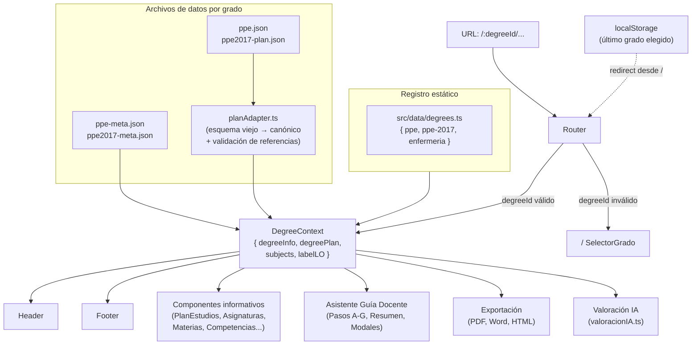

# Escalado multi-grado (plan revisado)

## Diagnóstico del estado actual

Los principales puntos de acoplamiento con un único grado son:

- **`src/lib/dataUtils.ts`**: importa `ppe.json` en duro y cachea el resultado a nivel de módulo.
- **~15 componentes** importan `ppe.json` directamente (o consumen `dataUtils` con ese dato fijo).
- **Texto hardcodeado** en: `Header.tsx`, `Footer.tsx`, `Home.tsx`, `Asignaturas.tsx`, `PlanEstudios.tsx`, `Materias.tsx`, `PasoA_Presentacion.tsx`, `ResumenGuiaDocente.tsx`, y las utilidades de exportación (`pdfGuiaDocente.ts`, `wordGuiaDocente.ts`, `htmlGuiaDocente.ts`).
- **Valoración IA acoplada a PPE**: `valoracionIA.ts` y `promptIA.md` asumen "RA1-RA27" y la terminología de PPE.
- **Borradores de guía en localStorage** sin distinguir grado ni asignatura (clave única `guiaDocente`).
- **Sin contexto global ni rutas por grado**: no se puede compartir ni recargar una URL con el grado concreto.

---

## Arquitectura propuesta



---

## 1. Terminología interna neutral

El modelo interno **no usa** ni `resultados_aprendizaje` ni `competencias` como nombre de campo. Se usa `learningOutcomes` en el esquema canónico. La etiqueta visible en UI viene de los metadatos del grado.

### Archivo `{grado}-meta.json` (metadatos del grado)

Claves en inglés, consistentes con `DegreeInfo`. Los valores son los textos que aparecerán en la UI.

```json
{
  "id": "ppe",
  "name": "Grado en Filosofía, Política y Economía",
  "shortName": "PPE",
  "university": "Universidad de Navarra",
  "ructCode": "2503724",
  "anecaVerified": true,
  "verificationYear": "2018",
  "lastUpdated": "30 octubre 2025",
  "primaryColor": "#1e3a8a",
  "logoSrc": "FaviconUnav_rojo.svg",
  "learningOutcomeLabel": {
    "singular": "resultado de aprendizaje",
    "plural": "resultados de aprendizaje",
    "acronym": "RA"
  }
}
```

Para PPE 2017 el bloque `learningOutcomeLabel` sería:

```json
"learningOutcomeLabel": {
  "singular": "competencia",
  "plural": "competencias",
  "acronym": "C"
}
```

### Archivo `{grado}-plan.json` (esquema canónico)

```json
{
  "schemaVersion": 1,
  "learningOutcomes": {
    "RA1": "...",
    "RA2": "..."
  },
  "trainingActivities": [
    { "id": "AF1", "name": "Asistencia a clases magistrales", "description": "..." }
  ],
  "teachingMethodologies": [],
  "evaluationSystems": [
    { "id": "SE1", "name": "Exámenes (escritos u orales)", "description": "..." }
  ],
  "modules": [
    {
      "name": "Módulo I: Filosofía y formación humanística",
      "ects": 69,
      "subjects": [
        {
          "name": "Core Curriculum",
          "ects": 18,
          "trainingActivities": ["AF1", "AF2"],
          "evaluation": [
            { "system": "SE1", "minWeight": "30%", "maxWeight": "60%" }
          ],
          "learningOutcomes": ["RA1", "RA2"],
          "courses": [
            { "name": "Antropología I", "type": "Obligatoria", "year": 1, "semester": 1, "ects": 3 }
          ]
        }
      ]
    }
  ]
}
```

Todos los campos usan inglés en el modelo interno para evitar colisiones con la terminología académica visible en la UI (que viene de los metadatos).

---

## 2. Estrategia de migración de JSON: adaptador temporal

`ppe.json` actual **no se renombra sin cambios**. En su lugar:

- Se mantiene `ppe.json` intacto como fuente.
- Se crea **`src/lib/planAdapter.ts`** que convierte el esquema actual al canónico en runtime.
- Una vez validado el funcionamiento completo, se migrará `ppe.json` al esquema canónico y se eliminará el adaptador.

```
ppe.json  →  planAdapter.ts  →  DegreePlan (canónico)  →  componentes
```

`ppe2017.json` se normaliza directamente a esquema canónico con IDs generados para sus actividades y sistemas de evaluación. Las asignaturas anuales usan `"semester": "annual"`:

```json
"trainingActivities": [
  { "id": "AF-PPE2017-1", "name": "Asistencia a clases magistrales", "description": "" },
  { "id": "AF-PPE2017-2", "name": "Seminarios de discusión", "description": "" }
],
...
"courses": [
  { "name": "Historia del Pensamiento Político", "type": "Obligatoria", "year": 2, "semester": "annual", "ects": 6 }
]
```

Esto evita lógica bifurcada en los componentes: todos reciben siempre la misma estructura, con IDs, independientemente del plan.

### Validación de referencias en `planAdapter.ts`

El adaptador no solo transforma la estructura; también valida que el plan resultante sea consistente internamente. Errores registrados en consola (no bloqueantes en producción):

- Todos los IDs en `subjectGroup.trainingActivities` existen en `degreePlan.trainingActivities`.
- Todos los IDs en `evaluationEntry.system` existen en `degreePlan.evaluationSystems`.
- Todos los IDs en `subjectGroup.learningOutcomes` existen en `degreePlan.learningOutcomes`.
- `schemaVersion` está presente y es un número.
- No hay módulos sin materias ni materias sin `courses`.

Esta misma validación se aplica también a `ppe2017-plan.json` en desarrollo.

---

## 3. Registro estático de grados

Nuevo archivo `src/data/degrees.ts` con imports directos (no dinámicos):

```typescript
import ppeMeta from './ppe-meta.json';
import ppePlanRaw from './ppe.json';
import ppe2017Meta from './ppe2017-meta.json';
import ppe2017Plan from './ppe2017-plan.json';
import { adaptLegacyPlan } from '../lib/planAdapter';

export const DEGREES: Record<string, { meta: DegreeInfo; plan: DegreePlan }> = {
  ppe: { meta: ppeMeta, plan: adaptLegacyPlan(ppePlanRaw) },
  'ppe-2017': { meta: ppe2017Meta, plan: ppe2017Plan },
};
```

Simple, completamente tipado, sin carga asíncrona. Añadir un nuevo grado = un import y una entrada en el objeto.

---

## 4. Rutas con el grado en la URL

Las rutas actuales pasan a estar prefijadas por `/:degreeId`:

| Antes | Después |
|---|---|
| `/` | `/` (selector de grado) |
| `/asignaturas` | `/ppe/asignaturas` |
| `/plan-estudios` | `/ppe/plan-estudios` |
| `/plan-estudios/:moduloSlug` | `/ppe/plan-estudios/:moduloSlug` |
| `/materias` | `/ppe/materias` |
| `/competencias` | `/ppe/competencias` |
| `/asistente-guia-docente` | `/ppe/asistente-guia-docente` |

- La ruta `/` muestra la pantalla de selección de grado, o redirige al último grado guardado en `localStorage`.
- `DegreeContext` lee el `degreeId` desde `useParams` (o desde un layout wrapper con `/:degreeId/*`).
- `localStorage` solo se usa para recordar el último grado elegido, nunca como fuente de verdad del grado activo.
- Los `<Navigate>` de compatibilidad existentes se actualizan correspondientemente.

---

## 5. Tipos TypeScript canónicos

Nuevo archivo `src/types/degree.ts`. Todo el modelo interno está en inglés; los campos de texto visible al usuario llegan siempre de los metadatos del grado.

```typescript
export interface LearningOutcomeLabel {
  singular: string;   // "resultado de aprendizaje" | "competencia"
  plural: string;     // "resultados de aprendizaje" | "competencias"
  acronym: string;    // "RA" | "C"
}

export interface DegreeInfo {
  id: string;
  name: string;           // "Grado en Filosofía, Política y Economía"
  shortName: string;      // "PPE"
  university: string;     // "Universidad de Navarra"
  ructCode?: string;
  anecaVerified: boolean;
  verificationYear?: string;
  lastUpdated?: string;
  primaryColor: string;
  logoSrc: string;
  learningOutcomeLabel: LearningOutcomeLabel;
}

export interface TrainingActivity   { id: string; name: string; description: string; }
export interface EvaluationSystem   { id: string; name: string; description: string; }
export interface TeachingMethodology { id: string; name: string; description: string; }

// semester admite valores numéricos (1 | 2) y "annual" para asignaturas anuales
export type Semester = 1 | 2 | 'annual';

export interface CourseEntry {
  name: string;
  type: string;           // "Obligatoria" | "Optativa" | ...
  year: number;
  semester: Semester;
  ects: number;
  evaluation?: EvaluationEntry[];
}

export interface EvaluationEntry { system: string; minWeight: string; maxWeight: string; }

export interface SubjectGroup {
  name: string;
  ects: number;
  trainingActivities: string[];    // IDs → trainingActivities[]
  evaluation: EvaluationEntry[];   // IDs → evaluationSystems[]
  learningOutcomes: string[];      // IDs → learningOutcomes dict
  courses: CourseEntry[];
}

export interface ModuleData { name: string; ects: number; subjects: SubjectGroup[]; }

export interface DegreePlan {
  schemaVersion: number;
  learningOutcomes: Record<string, string>;
  trainingActivities: TrainingActivity[];
  teachingMethodologies: TeachingMethodology[];   // puede ser []
  evaluationSystems: EvaluationSystem[];
  modules: ModuleData[];
}
```

`dataUtils.ts` se refactoriza para recibir `DegreePlan` como parámetro. La caché se mueve al contexto, no al módulo.

Los JSON `*-meta.json` usan las mismas claves en inglés que `DegreeInfo` (`name`, `shortName`, `ructCode`, etc.).

---

## 6. Contexto `DegreeContext`

Nuevo archivo `src/context/DegreeContext.tsx`:

```typescript
interface DegreeContextValue {
  degreeInfo: DegreeInfo;
  degreePlan: DegreePlan;
  subjects: ProcessedSubject[];   // lista plana precalculada
  labelLO: LearningOutcomeLabel;  // acceso directo a la etiqueta
}
```

- Lee `degreeId` desde los parámetros de la URL (vía un layout `<Route path="/:degreeId/*">`).
- Si el `degreeId` de la URL no existe en el registro, redirige a `/`.
- **No hay `setDegree`**: cambiar de grado es simplemente navegar a `/{nuevoGrado}/`. El `Header` incluye un enlace a `/` (o a `/{otroGrado}/`) para este propósito.

---

## 7. Borradores de guía docente por grado y asignatura

La clave de `localStorage` para los borradores pasa de:

```
guiaDocente
```

a:

```
guiaDocente:{degreeId}:{asignaturaSlug}
```

Ejemplos:
- `guiaDocente:ppe:historia-de-la-filosofia`
- `guiaDocente:ppe-2017:antropologia`

Esto permite tener múltiples borradores abiertos simultáneamente y elimina la pérdida de trabajo al cambiar de grado. `AsistenteGuiaDocente.tsx` usa la clave compuesta en todas las operaciones de lectura/escritura/borrado.

---

## 8. Desacoplamiento de la valoración IA

`src/utils/valoracionIA.ts` y `src/data/promptIA.md` actualmente asumen RA1-RA27 y la terminología de PPE.

Cambios:

- El payload enviado al webhook incluirá metadatos del grado activo:

```json
{
  "degreeId": "ppe",
  "degreeName": "Grado en Filosofía, Política y Economía",
  "learningOutcomeLabel": "resultados de aprendizaje",
  "planSchemaVersion": 1,
  "asignatura": { ... }
}
```

- `promptIA.md` se convierte en una plantilla con variables: `{{degreeName}}`, `{{learningOutcomeLabel}}`, `{{learningOutcomesList}}`. El texto fijo que mencione "PPE" o "RA" se parametriza.
- `valoracionIA.ts` recibe `DegreeInfo` y `DegreePlan` como parámetros para construir el prompt y el payload.

---

## 9. Cambios por archivo

**Archivos nuevos:**

- [`src/types/degree.ts`](src/types/degree.ts) — Tipos canónicos
- [`src/context/DegreeContext.tsx`](src/context/DegreeContext.tsx) — Contexto + layout wrapper
- [`src/data/degrees.ts`](src/data/degrees.ts) — Registro estático de grados
- [`src/lib/planAdapter.ts`](src/lib/planAdapter.ts) — Adaptador esquema legacy → canónico
- [`src/data/ppe-meta.json`](src/data/ppe-meta.json) — Metadatos PPE (extraídos de componentes)
- [`src/data/ppe2017-meta.json`](src/data/ppe2017-meta.json) — Metadatos PPE 2017
- [`src/data/ppe2017-plan.json`](src/data/ppe2017-plan.json) — `ppe2017.json` normalizado al esquema canónico

**Archivos modificados:**

- [`src/App.tsx`](src/App.tsx) — Rutas prefijadas `/:degreeId/*`, layout wrapper con DegreeContext
- [`src/lib/dataUtils.ts`](src/lib/dataUtils.ts) — Recibir `DegreePlan` como parámetro
- [`src/components/Header.tsx`](src/components/Header.tsx) — Nombre del grado activo desde contexto; enlace a `/` para cambiar de grado
- [`src/components/Footer.tsx`](src/components/Footer.tsx) — Nombre dinámico desde contexto
- [`src/components/Home.tsx`](src/components/Home.tsx) — Pantalla de selección si no hay `degreeId`; bloque ANECA/RUCT dinámico
- [`src/components/Breadcrumb.tsx`](src/components/Breadcrumb.tsx) — Usar contexto; rutas prefijadas
- [`src/components/PlanEstudios.tsx`](src/components/PlanEstudios.tsx) — Usar contexto
- [`src/components/Modulo.tsx`](src/components/Modulo.tsx) — Usar contexto
- [`src/components/Asignaturas.tsx`](src/components/Asignaturas.tsx) — Usar contexto
- [`src/components/AsignaturaDetalle.tsx`](src/components/AsignaturaDetalle.tsx) — Usar contexto
- [`src/components/Materias.tsx`](src/components/Materias.tsx) — Usar contexto
- [`src/components/Materia.tsx`](src/components/Materia.tsx) — Usar contexto
- [`src/components/Competencias.tsx`](src/components/Competencias.tsx) — Usar contexto; etiqueta dinámica desde `labelLO`
- [`src/components/CompetenciaDetalle.tsx`](src/components/CompetenciaDetalle.tsx) — Usar contexto
- [`src/components/AsistenteGuiaDocente.tsx`](src/components/AsistenteGuiaDocente.tsx) — Clave de borrador compuesta `guiaDocente:{degreeId}:{slug}`; datos desde contexto
- [`src/components/PasoA_Presentacion.tsx`](src/components/PasoA_Presentacion.tsx) — Titulación desde contexto
- [`src/components/PasoB_Competencias.tsx`](src/components/PasoB_Competencias.tsx) — Catálogo de `learningOutcomes` y etiqueta desde contexto
- [`src/components/PasoD_Actividades.tsx`](src/components/PasoD_Actividades.tsx) — Catálogo de `trainingActivities` desde contexto
- [`src/components/PasoE_Evaluacion.tsx`](src/components/PasoE_Evaluacion.tsx) — Catálogo de `evaluationSystems` desde contexto
- [`src/components/PasoC_Programa.tsx`](src/components/PasoC_Programa.tsx) — Sin datos del plan pero recibe titulación desde contexto
- [`src/components/PasoF_HorarioAtencion.tsx`](src/components/PasoF_HorarioAtencion.tsx) — Sin datos del plan; sin cambios de fondo
- [`src/components/PasoG_Bibliografia.tsx`](src/components/PasoG_Bibliografia.tsx) — Sin datos del plan; sin cambios de fondo
- [`src/components/ResumenGuiaDocente.tsx`](src/components/ResumenGuiaDocente.tsx) — Titulación desde contexto
- [`src/components/ModalBorradorGuia.tsx`](src/components/ModalBorradorGuia.tsx) — Usar clave de borrador compuesta
- [`src/components/ModalConfirmarEnvio.tsx`](src/components/ModalConfirmarEnvio.tsx) — Payload con metadatos del grado
- [`src/components/ModalValoracionIA.tsx`](src/components/ModalValoracionIA.tsx) — Recibir `degreeInfo` para construir el payload
- [`src/components/FiltrosAsignaturas.tsx`](src/components/FiltrosAsignaturas.tsx) — Filtros de módulo/materia desde datos del contexto (no hardcodeados)
- [`src/utils/pdfGuiaDocente.ts`](src/utils/pdfGuiaDocente.ts) — Recibir `DegreeInfo` como parámetro
- [`src/utils/wordGuiaDocente.ts`](src/utils/wordGuiaDocente.ts) — Idem
- [`src/utils/htmlGuiaDocente.ts`](src/utils/htmlGuiaDocente.ts) — Idem
- [`src/utils/valoracionIA.ts`](src/utils/valoracionIA.ts) — Payload y prompt parametrizados por grado
- [`src/data/promptIA.md`](src/data/promptIA.md) — Convertir a plantilla con variables de grado

---

## 10. Orden de implementación

1. Definir tipos canónicos en `src/types/degree.ts` (incluyendo `Semester = 1 | 2 | 'annual'`)
2. Crear `planAdapter.ts` con conversión + validación de referencias; verificar contra `ppe.json`
3. Crear `ppe-meta.json`, `ppe2017-meta.json` (claves en inglés) y `ppe2017-plan.json` normalizado con IDs generados y `semester: "annual"` donde corresponda
4. Crear registro estático `src/data/degrees.ts`
5. Crear `DegreeContext.tsx` con layout wrapper `/:degreeId/*`; redirigir a `/` si el ID no existe
6. Actualizar `App.tsx` con las nuevas rutas prefijadas (sin `setDegree` en el contexto)
7. Refactorizar `dataUtils.ts` como función pura que recibe `DegreePlan`
8. Actualizar `Home.tsx` (selector de grado) y `Header.tsx` / `Footer.tsx`
9. Actualizar `Breadcrumb.tsx` y `FiltrosAsignaturas.tsx`
10. Actualizar todos los componentes informativos (PlanEstudios, Asignaturas, Materias, Competencias...)
11. Actualizar todos los pasos del asistente (PasoA–PasoG), modales y ResumenGuiaDocente; claves de borrador compuestas
12. Actualizar utilidades de exportación (PDF, Word, HTML) para recibir `DegreeInfo`
13. Refactorizar `valoracionIA.ts`, `ModalValoracionIA.tsx` y `promptIA.md` con payload y plantilla parametrizados
